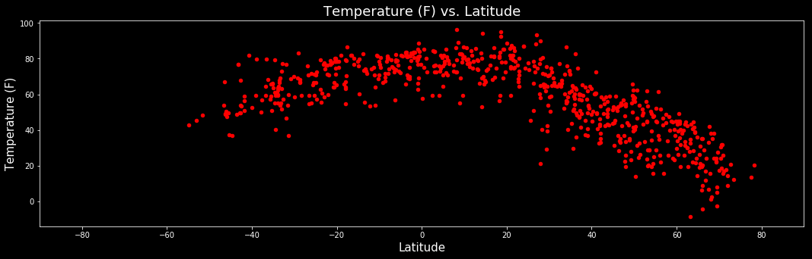
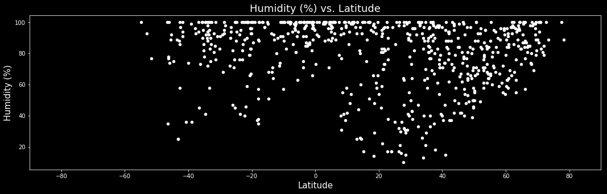
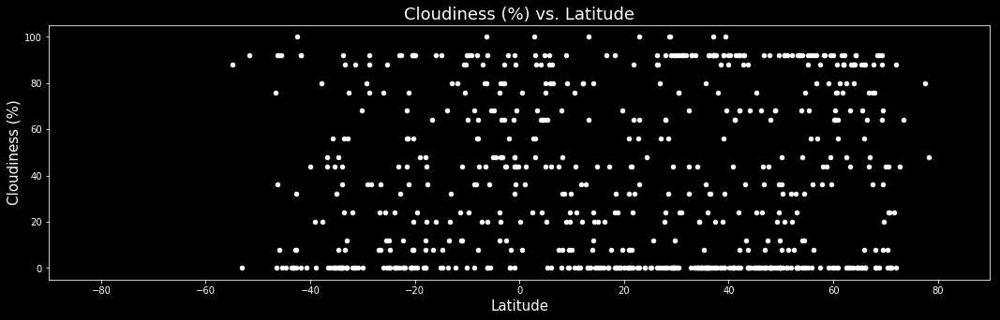
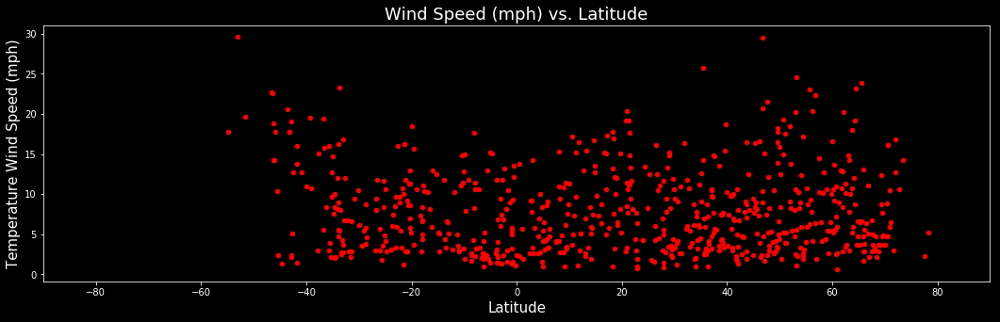

# ANALYSIS
1.With the Temperature and the latitude scatter plot, there is a positive correlation ie 
    an increase in temp increses lat
2.The average wind speed for all cities is fairly low in the winds speed and latitude 
    scatter plot
3.The wind speed are higher on average on the north and south poles.


```python
import pandas as pd
from citipy import citipy
import numpy as np
import pandas as pd
import requests
import json
import seaborn as sns
import matplotlib.pyplot as plt
%matplotlib inline
```

# Locate Nearest City


```python
#generate random list for latitudes and longitudes 

latitude = []
longitude = []

for each_lat in np.random.randint(-90,90,2000):
    latitude.append(each_lat)

for each_lon in np.random.randint(-180,180,2000):
    longitude.append(each_lon)
```

# Generate Dataframe for all latitudes and longitudes


```python
#Create a variable called latitude_and_Longitude and store all random latitudes and longitudes generated

latitude_and_Longitude = tuple(zip(latitude,longitude))
```


```python
#use citipy library to find the nearest city for all latitudes and longitudes

cities = []
country = []

for lat,lon in latitude_and_Longitude:
    city = citipy.nearest_city(lat,lon)
    
    cityName = city.city_name
    
    cities.append(cityName)
    
    country.append(city.country_code)
```


```python
#Print out how many the different cities were generated

print('The above script has generated {} different cities using random numbers.'.format(len(set(cities))))
```

    The above script has generated 786 different cities using random numbers.


```python
#create a dataframe to store all the cities and countries generated with citipy

df_countries = pd.DataFrame({'Cities': cities,
              'Country': country})

#add additional blank columns to store information from openweathermap api

df_countries['Latitude'] = ''
df_countries['Longitude'] = ''
df_countries['Temperature (F)'] = ''
df_countries['Humidity (%)'] = ''
df_countries['Cloudiness (%)'] = ''
df_countries['Wind Speed (mph)'] = ''
```


```python
#drop all duplicates in column Cities.

df_countries = df_countries.drop_duplicates(subset=['Cities'],keep='first')

#api key used with openweathermap api

api_key = "5be78fade1727ace968b5ab363d997bd"

# Use Openweathermap API

#loop through all rows and fill in values for blank columns in dataframe

for index,row in df_countries.iterrows():
    city_name = row['Cities']
    Country_id = row['Country']
    
    
    #api call for all Cities 
    api_url = "http://api.openweathermap.org/data/2.5/forecast" \
    "?q={},{}&units=IMPERIAL&mode=json&APPID={}".format(city_name,Country_id,api_key)
    
    
    country_info = requests.get(api_url).json()
    
    #print all api url's for each city
    print(api_url)
    
    
    try:
        df_countries.set_value(index,'Latitude',country_info['city']['coord']['lat'])
        df_countries.set_value(index,'Longitude',country_info['city']['coord']['lon'])
        df_countries.set_value(index,'Temperature (F)',country_info['list'][0]['main']['temp'])
        df_countries.set_value(index,'Humidity (%)',country_info['list'][0]['main']['humidity'])
        df_countries.set_value(index,'Cloudiness (%)',country_info['list'][0]['clouds']['all'])
        df_countries.set_value(index,'Wind Speed (mph)',country_info['list'][0]['wind']['speed'])
        
    except KeyError:
        df_countries.set_value(index,'Latitude',np.nan)
        df_countries.set_value(index,'Longitude',np.nan)
        df_countries.set_value(index,'Temperature (F)',np.nan)
        df_countries.set_value(index,'Humidity (%)',np.nan)
        df_countries.set_value(index,'Cloudiness (%)',np.nan)
        df_countries.set_value(index,'Wind Speed (mph)',np.nan)
        
        print('Missing weather information...skip')

#change all data recieved from openweathermap api to numerical data
df_countries['Latitude'] = pd.to_numeric(df_countries['Latitude'])
df_countries['Longitude'] = pd.to_numeric(df_countries['Longitude'])
df_countries['Temperature (F)'] = pd.to_numeric(df_countries['Temperature (F)'])
df_countries['Humidity (%)'] = pd.to_numeric(df_countries['Humidity (%)'])
df_countries['Cloudiness (%)'] = pd.to_numeric(df_countries['Cloudiness (%)'])
df_countries['Wind Speed (mph)'] = pd.to_numeric(df_countries['Wind Speed (mph)'])
```

    http://api.openweathermap.org/data/2.5/forecast?q=harper,lr&units=IMPERIAL&mode=json&APPID=5be78fade1727ace968b5ab363d997bd


recast?q=khuzhir,ru&units=IMPERIAL&mode=json&APPID=5be78fade1727ace968b5ab363d997bd

    


```python
#display dataframe df_countries after openweathermap api calls 
df_countries.head()

```


<div>
<style scoped>
    .dataframe tbody tr th:only-of-type {
        vertical-align: middle;
    }

    .dataframe tbody tr th {
        vertical-align: top;
    }

    .dataframe thead th {
        text-align: right;
    }
</style>
<table border="1" class="dataframe">
  <thead>
    <tr style="text-align: right;">
      <th></th>
      <th>Cities</th>
      <th>Country</th>
      <th>Latitude</th>
      <th>Longitude</th>
      <th>Temperature (F)</th>
      <th>Humidity (%)</th>
      <th>Cloudiness (%)</th>
      <th>Wind Speed (mph)</th>
    </tr>
  </thead>
  <tbody>
    <tr>
      <th>0</th>
      <td>harper</td>
      <td>lr</td>
      <td>4.3770</td>
      <td>-7.7141</td>
      <td>81.88</td>
      <td>100.0</td>
      <td>64.0</td>
      <td>10.00</td>
    </tr>
    <tr>
      <th>1</th>
      <td>tuktoyaktuk</td>
      <td>ca</td>
      <td>69.4440</td>
      <td>-133.0320</td>
      <td>-2.75</td>
      <td>100.0</td>
      <td>8.0</td>
      <td>4.74</td>
    </tr>
    <tr>
      <th>2</th>
      <td>hilo</td>
      <td>us</td>
      <td>19.7072</td>
      <td>-155.0817</td>
      <td>78.01</td>
      <td>100.0</td>
      <td>68.0</td>
      <td>15.03</td>
    </tr>
    <tr>
      <th>3</th>
      <td>pathardi</td>
      <td>in</td>
      <td>19.1717</td>
      <td>75.1746</td>
      <td>69.26</td>
      <td>61.0</td>
      <td>0.0</td>
      <td>6.53</td>
    </tr>
    <tr>
      <th>4</th>
      <td>new waterford</td>
      <td>ca</td>
      <td>46.2501</td>
      <td>-60.0818</td>
      <td>36.70</td>
      <td>81.0</td>
      <td>68.0</td>
      <td>16.60</td>
    </tr>
  </tbody>
</table>
</div>


```python
length_of_original_DF = len(df_countries)
length_after_dropna = len(df_countries.dropna())

missing_weather_info = length_of_original_DF - length_after_dropna
```


```python
print('For the following cities associated with this dataframe, {} cities did not contain weather\
 information. These cities\t will be dropped from this dataframe.'.format(missing_weather_info))

print('\n')

print("The dataframe used for plotting contains weather information for {} different cities. "\
      .format(len(df_countries.dropna())))
```

    For the following cities associated with this dataframe, 96 cities did not contain weather information. These cities	 will be dropped from this dataframe.
    
    
    The dataframe used for plotting contains weather information for 690 different cities. 


```python
df_countries = df_countries.dropna()
df_countries.to_csv(path_or_buf='df_countries.csv')
```


```python
df_countries_table = df_countries.copy()
df_countries_table['Latitude'] = pd.qcut(df_countries['Latitude'],11,precision=0)
```


```python
cm = sns.light_palette('green',as_cmap=True)

df_countries_table.groupby(['Latitude'])['Temperature (F)'].mean().reset_index().style.background_gradient(cmap=cm)
```


<style  type="text/css" >
    #T_8a66618c_45a6_11e8_ac86_3c07541c96c2row0_col1 {
            background-color:  #4ba94b;
        }    #T_8a66618c_45a6_11e8_ac86_3c07541c96c2row1_col1 {
            background-color:  #209220;
        }    #T_8a66618c_45a6_11e8_ac86_3c07541c96c2row2_col1 {
            background-color:  #0e880e;
        }    #T_8a66618c_45a6_11e8_ac86_3c07541c96c2row3_col1 {
            background-color:  #008000;
        }    #T_8a66618c_45a6_11e8_ac86_3c07541c96c2row4_col1 {
            background-color:  #018001;
        }    #T_8a66618c_45a6_11e8_ac86_3c07541c96c2row5_col1 {
            background-color:  #098509;
        }    #T_8a66618c_45a6_11e8_ac86_3c07541c96c2row6_col1 {
            background-color:  #44a544;
        }    #T_8a66618c_45a6_11e8_ac86_3c07541c96c2row7_col1 {
            background-color:  #6fbd6f;
        }    #T_8a66618c_45a6_11e8_ac86_3c07541c96c2row8_col1 {
            background-color:  #91d091;
        }    #T_8a66618c_45a6_11e8_ac86_3c07541c96c2row9_col1 {
            background-color:  #abdfab;
        }    #T_8a66618c_45a6_11e8_ac86_3c07541c96c2row10_col1 {
            background-color:  #e5ffe5;
        }</style>  
<table id="T_8a66618c_45a6_11e8_ac86_3c07541c96c2" > 
<thead>    <tr> 
        <th class="blank level0" ></th> 
        <th class="col_heading level0 col0" >Latitude</th> 
        <th class="col_heading level0 col1" >Temperature (F)</th> 
    </tr></thead> 
<tbody>    <tr> 
        <th id="T_8a66618c_45a6_11e8_ac86_3c07541c96c2level0_row0" class="row_heading level0 row0" >0</th> 
        <td id="T_8a66618c_45a6_11e8_ac86_3c07541c96c2row0_col0" class="data row0 col0" >(-56.0, -32.0]</td> 
        <td id="T_8a66618c_45a6_11e8_ac86_3c07541c96c2row0_col1" class="data row0 col1" >59.2757</td> 
    </tr>    <tr> 
        <th id="T_8a66618c_45a6_11e8_ac86_3c07541c96c2level0_row1" class="row_heading level0 row1" >1</th> 
        <td id="T_8a66618c_45a6_11e8_ac86_3c07541c96c2row1_col0" class="data row1 col0" >(-32.0, -19.0]</td> 
        <td id="T_8a66618c_45a6_11e8_ac86_3c07541c96c2row1_col1" class="data row1 col1" >69.2494</td> 
    </tr>    <tr> 
        <th id="T_8a66618c_45a6_11e8_ac86_3c07541c96c2level0_row2" class="row_heading level0 row2" >2</th> 
        <td id="T_8a66618c_45a6_11e8_ac86_3c07541c96c2row2_col0" class="data row2 col0" >(-19.0, -5.0]</td> 
        <td id="T_8a66618c_45a6_11e8_ac86_3c07541c96c2row2_col1" class="data row2 col1" >73.5802</td> 
    </tr>    <tr> 
        <th id="T_8a66618c_45a6_11e8_ac86_3c07541c96c2level0_row3" class="row_heading level0 row3" >3</th> 
        <td id="T_8a66618c_45a6_11e8_ac86_3c07541c96c2row3_col0" class="data row3 col0" >(-5.0, 6.0]</td> 
        <td id="T_8a66618c_45a6_11e8_ac86_3c07541c96c2row3_col1" class="data row3 col1" >77.0794</td> 
    </tr>    <tr> 
        <th id="T_8a66618c_45a6_11e8_ac86_3c07541c96c2level0_row4" class="row_heading level0 row4" >4</th> 
        <td id="T_8a66618c_45a6_11e8_ac86_3c07541c96c2row4_col0" class="data row4 col0" >(6.0, 18.0]</td> 
        <td id="T_8a66618c_45a6_11e8_ac86_3c07541c96c2row4_col1" class="data row4 col1" >76.7459</td> 
    </tr>    <tr> 
        <th id="T_8a66618c_45a6_11e8_ac86_3c07541c96c2level0_row5" class="row_heading level0 row5" >5</th> 
        <td id="T_8a66618c_45a6_11e8_ac86_3c07541c96c2row5_col0" class="data row5 col0" >(18.0, 29.0]</td> 
        <td id="T_8a66618c_45a6_11e8_ac86_3c07541c96c2row5_col1" class="data row5 col1" >74.9052</td> 
    </tr>    <tr> 
        <th id="T_8a66618c_45a6_11e8_ac86_3c07541c96c2level0_row6" class="row_heading level0 row6" >6</th> 
        <td id="T_8a66618c_45a6_11e8_ac86_3c07541c96c2row6_col0" class="data row6 col0" >(29.0, 37.0]</td> 
        <td id="T_8a66618c_45a6_11e8_ac86_3c07541c96c2row6_col1" class="data row6 col1" >61.0656</td> 
    </tr>    <tr> 
        <th id="T_8a66618c_45a6_11e8_ac86_3c07541c96c2level0_row7" class="row_heading level0 row7" >7</th> 
        <td id="T_8a66618c_45a6_11e8_ac86_3c07541c96c2row7_col0" class="data row7 col0" >(37.0, 46.0]</td> 
        <td id="T_8a66618c_45a6_11e8_ac86_3c07541c96c2row7_col1" class="data row7 col1" >50.6846</td> 
    </tr>    <tr> 
        <th id="T_8a66618c_45a6_11e8_ac86_3c07541c96c2level0_row8" class="row_heading level0 row8" >8</th> 
        <td id="T_8a66618c_45a6_11e8_ac86_3c07541c96c2row8_col0" class="data row8 col0" >(46.0, 53.0]</td> 
        <td id="T_8a66618c_45a6_11e8_ac86_3c07541c96c2row8_col1" class="data row8 col1" >42.7377</td> 
    </tr>    <tr> 
        <th id="T_8a66618c_45a6_11e8_ac86_3c07541c96c2level0_row9" class="row_heading level0 row9" >9</th> 
        <td id="T_8a66618c_45a6_11e8_ac86_3c07541c96c2row9_col0" class="data row9 col0" >(53.0, 63.0]</td> 
        <td id="T_8a66618c_45a6_11e8_ac86_3c07541c96c2row9_col1" class="data row9 col1" >36.5708</td> 
    </tr>    <tr> 
        <th id="T_8a66618c_45a6_11e8_ac86_3c07541c96c2level0_row10" class="row_heading level0 row10" >10</th> 
        <td id="T_8a66618c_45a6_11e8_ac86_3c07541c96c2row10_col0" class="data row10 col0" >(63.0, 78.0]</td> 
        <td id="T_8a66618c_45a6_11e8_ac86_3c07541c96c2row10_col1" class="data row10 col1" >22.5043</td> 
    </tr></tbody> 
</table> 


```python
#plot the following plots Temperature (F) vs. Lat, Humidity (%) vs. Lat, Cloudiness (%) vs. Lat, and 
#Wind Speed (mph) vs. Lat

plt.style.use('dark_background')
```


```python
plt.figure(figsize=(18,5))
plt.scatter(df_countries['Latitude'],df_countries['Temperature (F)'],color = 'red',s=20)
plt.title('Temperature (F) vs. Latitude',fontsize=(18));
plt.xlim(-90,90)
plt.ylabel('Temperature (F)',fontsize=(15));
plt.xlabel('Latitude',fontsize=(15));
plt.show()
```





```python
plt.savefig('sam1.png')
```


    <matplotlib.figure.Figure at 0x1a23c9b908>


```python
df_countries_table.groupby(['Latitude'])['Humidity (%)'].mean().reset_index().style.background_gradient(cmap=cm)
```


<style  type="text/css" >
    #T_8aa6ef68_45a6_11e8_b177_3c07541c96c2row0_col1 {
            background-color:  #50ac50;
        }    #T_8aa6ef68_45a6_11e8_b177_3c07541c96c2row1_col1 {
            background-color:  #41a441;
        }    #T_8aa6ef68_45a6_11e8_b177_3c07541c96c2row2_col1 {
            background-color:  #389f38;
        }    #T_8aa6ef68_45a6_11e8_b177_3c07541c96c2row3_col1 {
            background-color:  #008000;
        }    #T_8aa6ef68_45a6_11e8_b177_3c07541c96c2row4_col1 {
            background-color:  #65b865;
        }    #T_8aa6ef68_45a6_11e8_b177_3c07541c96c2row5_col1 {
            background-color:  #e5ffe5;
        }    #T_8aa6ef68_45a6_11e8_b177_3c07541c96c2row6_col1 {
            background-color:  #9ed89e;
        }    #T_8aa6ef68_45a6_11e8_b177_3c07541c96c2row7_col1 {
            background-color:  #9ed79e;
        }    #T_8aa6ef68_45a6_11e8_b177_3c07541c96c2row8_col1 {
            background-color:  #b5e4b5;
        }    #T_8aa6ef68_45a6_11e8_b177_3c07541c96c2row9_col1 {
            background-color:  #70be70;
        }    #T_8aa6ef68_45a6_11e8_b177_3c07541c96c2row10_col1 {
            background-color:  #2b982b;
        }</style>  
<table id="T_8aa6ef68_45a6_11e8_b177_3c07541c96c2" > 
<thead>    <tr> 
        <th class="blank level0" ></th> 
        <th class="col_heading level0 col0" >Latitude</th> 
        <th class="col_heading level0 col1" >Humidity (%)</th> 
    </tr></thead> 
<tbody>    <tr> 
        <th id="T_8aa6ef68_45a6_11e8_b177_3c07541c96c2level0_row0" class="row_heading level0 row0" >0</th> 
        <td id="T_8aa6ef68_45a6_11e8_b177_3c07541c96c2row0_col0" class="data row0 col0" >(-56.0, -32.0]</td> 
        <td id="T_8aa6ef68_45a6_11e8_b177_3c07541c96c2row0_col1" class="data row0 col1" >83.6032</td> 
    </tr>    <tr> 
        <th id="T_8aa6ef68_45a6_11e8_b177_3c07541c96c2level0_row1" class="row_heading level0 row1" >1</th> 
        <td id="T_8aa6ef68_45a6_11e8_b177_3c07541c96c2row1_col0" class="data row1 col0" >(-32.0, -19.0]</td> 
        <td id="T_8aa6ef68_45a6_11e8_b177_3c07541c96c2row1_col1" class="data row1 col1" >85.6349</td> 
    </tr>    <tr> 
        <th id="T_8aa6ef68_45a6_11e8_b177_3c07541c96c2level0_row2" class="row_heading level0 row2" >2</th> 
        <td id="T_8aa6ef68_45a6_11e8_b177_3c07541c96c2row2_col0" class="data row2 col0" >(-19.0, -5.0]</td> 
        <td id="T_8aa6ef68_45a6_11e8_b177_3c07541c96c2row2_col1" class="data row2 col1" >86.7581</td> 
    </tr>    <tr> 
        <th id="T_8aa6ef68_45a6_11e8_b177_3c07541c96c2level0_row3" class="row_heading level0 row3" >3</th> 
        <td id="T_8aa6ef68_45a6_11e8_b177_3c07541c96c2row3_col0" class="data row3 col0" >(-5.0, 6.0]</td> 
        <td id="T_8aa6ef68_45a6_11e8_b177_3c07541c96c2row3_col1" class="data row3 col1" >93.9048</td> 
    </tr>    <tr> 
        <th id="T_8aa6ef68_45a6_11e8_b177_3c07541c96c2level0_row4" class="row_heading level0 row4" >4</th> 
        <td id="T_8aa6ef68_45a6_11e8_b177_3c07541c96c2row4_col0" class="data row4 col0" >(6.0, 18.0]</td> 
        <td id="T_8aa6ef68_45a6_11e8_b177_3c07541c96c2row4_col1" class="data row4 col1" >81.0635</td> 
    </tr>    <tr> 
        <th id="T_8aa6ef68_45a6_11e8_b177_3c07541c96c2level0_row5" class="row_heading level0 row5" >5</th> 
        <td id="T_8aa6ef68_45a6_11e8_b177_3c07541c96c2row5_col0" class="data row5 col0" >(18.0, 29.0]</td> 
        <td id="T_8aa6ef68_45a6_11e8_b177_3c07541c96c2row5_col1" class="data row5 col1" >64.5645</td> 
    </tr>    <tr> 
        <th id="T_8aa6ef68_45a6_11e8_b177_3c07541c96c2level0_row6" class="row_heading level0 row6" >6</th> 
        <td id="T_8aa6ef68_45a6_11e8_b177_3c07541c96c2row6_col0" class="data row6 col0" >(29.0, 37.0]</td> 
        <td id="T_8aa6ef68_45a6_11e8_b177_3c07541c96c2row6_col1" class="data row6 col1" >73.6508</td> 
    </tr>    <tr> 
        <th id="T_8aa6ef68_45a6_11e8_b177_3c07541c96c2level0_row7" class="row_heading level0 row7" >7</th> 
        <td id="T_8aa6ef68_45a6_11e8_b177_3c07541c96c2row7_col0" class="data row7 col0" >(37.0, 46.0]</td> 
        <td id="T_8aa6ef68_45a6_11e8_b177_3c07541c96c2row7_col1" class="data row7 col1" >73.746</td> 
    </tr>    <tr> 
        <th id="T_8aa6ef68_45a6_11e8_b177_3c07541c96c2level0_row8" class="row_heading level0 row8" >8</th> 
        <td id="T_8aa6ef68_45a6_11e8_b177_3c07541c96c2row8_col0" class="data row8 col0" >(46.0, 53.0]</td> 
        <td id="T_8aa6ef68_45a6_11e8_b177_3c07541c96c2row8_col1" class="data row8 col1" >70.7581</td> 
    </tr>    <tr> 
        <th id="T_8aa6ef68_45a6_11e8_b177_3c07541c96c2level0_row9" class="row_heading level0 row9" >9</th> 
        <td id="T_8aa6ef68_45a6_11e8_b177_3c07541c96c2row9_col0" class="data row9 col0" >(53.0, 63.0]</td> 
        <td id="T_8aa6ef68_45a6_11e8_b177_3c07541c96c2row9_col1" class="data row9 col1" >79.5714</td> 
    </tr>    <tr> 
        <th id="T_8aa6ef68_45a6_11e8_b177_3c07541c96c2level0_row10" class="row_heading level0 row10" >10</th> 
        <td id="T_8aa6ef68_45a6_11e8_b177_3c07541c96c2row10_col0" class="data row10 col0" >(63.0, 78.0]</td> 
        <td id="T_8aa6ef68_45a6_11e8_b177_3c07541c96c2row10_col1" class="data row10 col1" >88.3651</td> 
    </tr></tbody> 
</table> 


```python
plt.figure(figsize=(18,5))
plt.scatter(df_countries['Latitude'],df_countries['Humidity (%)'],color = 'white',s=20);
plt.title('Humidity (%) vs. Latitude',fontsize=(18));
plt.xlim(-90,90)
plt.ylabel('Humidity (%)',fontsize=(15));
plt.xlabel('Latitude',fontsize=(15));
```





```python
plt.savefig('sam.png')
```


    <matplotlib.figure.Figure at 0x1a23e432e8>


```python
df_countries_table.groupby(['Latitude'])['Cloudiness (%)'].mean().reset_index().style.background_gradient(cmap=cm)
```


<style  type="text/css" >
    #T_8af3b6f4_45a6_11e8_93cf_3c07541c96c2row0_col1 {
            background-color:  #bfeabf;
        }    #T_8af3b6f4_45a6_11e8_93cf_3c07541c96c2row1_col1 {
            background-color:  #9ed79e;
        }    #T_8af3b6f4_45a6_11e8_93cf_3c07541c96c2row2_col1 {
            background-color:  #5eb45e;
        }    #T_8af3b6f4_45a6_11e8_93cf_3c07541c96c2row3_col1 {
            background-color:  #0e880e;
        }    #T_8af3b6f4_45a6_11e8_93cf_3c07541c96c2row4_col1 {
            background-color:  #b4e4b4;
        }    #T_8af3b6f4_45a6_11e8_93cf_3c07541c96c2row5_col1 {
            background-color:  #b6e5b6;
        }    #T_8af3b6f4_45a6_11e8_93cf_3c07541c96c2row6_col1 {
            background-color:  #afe1af;
        }    #T_8af3b6f4_45a6_11e8_93cf_3c07541c96c2row7_col1 {
            background-color:  #70be70;
        }    #T_8af3b6f4_45a6_11e8_93cf_3c07541c96c2row8_col1 {
            background-color:  #e5ffe5;
        }    #T_8af3b6f4_45a6_11e8_93cf_3c07541c96c2row9_col1 {
            background-color:  #008000;
        }    #T_8af3b6f4_45a6_11e8_93cf_3c07541c96c2row10_col1 {
            background-color:  #56b056;
        }</style>  
<table id="T_8af3b6f4_45a6_11e8_93cf_3c07541c96c2" > 
<thead>    <tr> 
        <th class="blank level0" ></th> 
        <th class="col_heading level0 col0" >Latitude</th> 
        <th class="col_heading level0 col1" >Cloudiness (%)</th> 
    </tr></thead> 
<tbody>    <tr> 
        <th id="T_8af3b6f4_45a6_11e8_93cf_3c07541c96c2level0_row0" class="row_heading level0 row0" >0</th> 
        <td id="T_8af3b6f4_45a6_11e8_93cf_3c07541c96c2row0_col0" class="data row0 col0" >(-56.0, -32.0]</td> 
        <td id="T_8af3b6f4_45a6_11e8_93cf_3c07541c96c2row0_col1" class="data row0 col1" >29.6508</td> 
    </tr>    <tr> 
        <th id="T_8af3b6f4_45a6_11e8_93cf_3c07541c96c2level0_row1" class="row_heading level0 row1" >1</th> 
        <td id="T_8af3b6f4_45a6_11e8_93cf_3c07541c96c2row1_col0" class="data row1 col0" >(-32.0, -19.0]</td> 
        <td id="T_8af3b6f4_45a6_11e8_93cf_3c07541c96c2row1_col1" class="data row1 col1" >33.8413</td> 
    </tr>    <tr> 
        <th id="T_8af3b6f4_45a6_11e8_93cf_3c07541c96c2level0_row2" class="row_heading level0 row2" >2</th> 
        <td id="T_8af3b6f4_45a6_11e8_93cf_3c07541c96c2row2_col0" class="data row2 col0" >(-19.0, -5.0]</td> 
        <td id="T_8af3b6f4_45a6_11e8_93cf_3c07541c96c2row2_col1" class="data row2 col1" >41.7419</td> 
    </tr>    <tr> 
        <th id="T_8af3b6f4_45a6_11e8_93cf_3c07541c96c2level0_row3" class="row_heading level0 row3" >3</th> 
        <td id="T_8af3b6f4_45a6_11e8_93cf_3c07541c96c2row3_col0" class="data row3 col0" >(-5.0, 6.0]</td> 
        <td id="T_8af3b6f4_45a6_11e8_93cf_3c07541c96c2row3_col1" class="data row3 col1" >51.8095</td> 
    </tr>    <tr> 
        <th id="T_8af3b6f4_45a6_11e8_93cf_3c07541c96c2level0_row4" class="row_heading level0 row4" >4</th> 
        <td id="T_8af3b6f4_45a6_11e8_93cf_3c07541c96c2row4_col0" class="data row4 col0" >(6.0, 18.0]</td> 
        <td id="T_8af3b6f4_45a6_11e8_93cf_3c07541c96c2row4_col1" class="data row4 col1" >30.9841</td> 
    </tr>    <tr> 
        <th id="T_8af3b6f4_45a6_11e8_93cf_3c07541c96c2level0_row5" class="row_heading level0 row5" >5</th> 
        <td id="T_8af3b6f4_45a6_11e8_93cf_3c07541c96c2row5_col0" class="data row5 col0" >(18.0, 29.0]</td> 
        <td id="T_8af3b6f4_45a6_11e8_93cf_3c07541c96c2row5_col1" class="data row5 col1" >30.7097</td> 
    </tr>    <tr> 
        <th id="T_8af3b6f4_45a6_11e8_93cf_3c07541c96c2level0_row6" class="row_heading level0 row6" >6</th> 
        <td id="T_8af3b6f4_45a6_11e8_93cf_3c07541c96c2row6_col0" class="data row6 col0" >(29.0, 37.0]</td> 
        <td id="T_8af3b6f4_45a6_11e8_93cf_3c07541c96c2row6_col1" class="data row6 col1" >31.619</td> 
    </tr>    <tr> 
        <th id="T_8af3b6f4_45a6_11e8_93cf_3c07541c96c2level0_row7" class="row_heading level0 row7" >7</th> 
        <td id="T_8af3b6f4_45a6_11e8_93cf_3c07541c96c2row7_col0" class="data row7 col0" >(37.0, 46.0]</td> 
        <td id="T_8af3b6f4_45a6_11e8_93cf_3c07541c96c2row7_col1" class="data row7 col1" >39.4286</td> 
    </tr>    <tr> 
        <th id="T_8af3b6f4_45a6_11e8_93cf_3c07541c96c2level0_row8" class="row_heading level0 row8" >8</th> 
        <td id="T_8af3b6f4_45a6_11e8_93cf_3c07541c96c2row8_col0" class="data row8 col0" >(46.0, 53.0]</td> 
        <td id="T_8af3b6f4_45a6_11e8_93cf_3c07541c96c2row8_col1" class="data row8 col1" >24.7097</td> 
    </tr>    <tr> 
        <th id="T_8af3b6f4_45a6_11e8_93cf_3c07541c96c2level0_row9" class="row_heading level0 row9" >9</th> 
        <td id="T_8af3b6f4_45a6_11e8_93cf_3c07541c96c2row9_col0" class="data row9 col0" >(53.0, 63.0]</td> 
        <td id="T_8af3b6f4_45a6_11e8_93cf_3c07541c96c2row9_col1" class="data row9 col1" >53.6508</td> 
    </tr>    <tr> 
        <th id="T_8af3b6f4_45a6_11e8_93cf_3c07541c96c2level0_row10" class="row_heading level0 row10" >10</th> 
        <td id="T_8af3b6f4_45a6_11e8_93cf_3c07541c96c2row10_col0" class="data row10 col0" >(63.0, 78.0]</td> 
        <td id="T_8af3b6f4_45a6_11e8_93cf_3c07541c96c2row10_col1" class="data row10 col1" >42.7302</td> 
    </tr></tbody> 
</table> 


```python
plt.figure(figsize=(18,5))
plt.scatter(df_countries['Latitude'],df_countries['Cloudiness (%)'],color = 'w',s=20);
plt.title('Cloudiness (%) vs. Latitude',fontsize=(18));
plt.xlim(-90,90)
plt.ylabel('Cloudiness (%)',fontsize=(15));
plt.xlabel('Latitude',fontsize=(15));
```





```python
plt.savefig('sam3.png')
```


    <matplotlib.figure.Figure at 0x1a23736ba8>


```python
df_countries_table.groupby(['Latitude'])['Wind Speed (mph)'].mean().reset_index().style.background_gradient(cmap=cm)
```


<style  type="text/css" >
    #T_8b3e494c_45a6_11e8_bab1_3c07541c96c2row0_col1 {
            background-color:  #008000;
        }    #T_8b3e494c_45a6_11e8_bab1_3c07541c96c2row1_col1 {
            background-color:  #9dd79d;
        }    #T_8b3e494c_45a6_11e8_bab1_3c07541c96c2row2_col1 {
            background-color:  #c2ebc2;
        }    #T_8b3e494c_45a6_11e8_bab1_3c07541c96c2row3_col1 {
            background-color:  #e5ffe5;
        }    #T_8b3e494c_45a6_11e8_bab1_3c07541c96c2row4_col1 {
            background-color:  #8fcf8f;
        }    #T_8b3e494c_45a6_11e8_bab1_3c07541c96c2row5_col1 {
            background-color:  #6abb6a;
        }    #T_8b3e494c_45a6_11e8_bab1_3c07541c96c2row6_col1 {
            background-color:  #c6eec6;
        }    #T_8b3e494c_45a6_11e8_bab1_3c07541c96c2row7_col1 {
            background-color:  #a7dda7;
        }    #T_8b3e494c_45a6_11e8_bab1_3c07541c96c2row8_col1 {
            background-color:  #56af56;
        }    #T_8b3e494c_45a6_11e8_bab1_3c07541c96c2row9_col1 {
            background-color:  #6abb6a;
        }    #T_8b3e494c_45a6_11e8_bab1_3c07541c96c2row10_col1 {
            background-color:  #94d294;
        }</style>  
<table id="T_8b3e494c_45a6_11e8_bab1_3c07541c96c2" > 
<thead>    <tr> 
        <th class="blank level0" ></th> 
        <th class="col_heading level0 col0" >Latitude</th> 
        <th class="col_heading level0 col1" >Wind Speed (mph)</th> 
    </tr></thead> 
<tbody>    <tr> 
        <th id="T_8b3e494c_45a6_11e8_bab1_3c07541c96c2level0_row0" class="row_heading level0 row0" >0</th> 
        <td id="T_8b3e494c_45a6_11e8_bab1_3c07541c96c2row0_col0" class="data row0 col0" >(-56.0, -32.0]</td> 
        <td id="T_8b3e494c_45a6_11e8_bab1_3c07541c96c2row0_col1" class="data row0 col1" >10.8692</td> 
    </tr>    <tr> 
        <th id="T_8b3e494c_45a6_11e8_bab1_3c07541c96c2level0_row1" class="row_heading level0 row1" >1</th> 
        <td id="T_8b3e494c_45a6_11e8_bab1_3c07541c96c2row1_col0" class="data row1 col0" >(-32.0, -19.0]</td> 
        <td id="T_8b3e494c_45a6_11e8_bab1_3c07541c96c2row1_col1" class="data row1 col1" >7.42444</td> 
    </tr>    <tr> 
        <th id="T_8b3e494c_45a6_11e8_bab1_3c07541c96c2level0_row2" class="row_heading level0 row2" >2</th> 
        <td id="T_8b3e494c_45a6_11e8_bab1_3c07541c96c2row2_col0" class="data row2 col0" >(-19.0, -5.0]</td> 
        <td id="T_8b3e494c_45a6_11e8_bab1_3c07541c96c2row2_col1" class="data row2 col1" >6.6021</td> 
    </tr>    <tr> 
        <th id="T_8b3e494c_45a6_11e8_bab1_3c07541c96c2level0_row3" class="row_heading level0 row3" >3</th> 
        <td id="T_8b3e494c_45a6_11e8_bab1_3c07541c96c2row3_col0" class="data row3 col0" >(-5.0, 6.0]</td> 
        <td id="T_8b3e494c_45a6_11e8_bab1_3c07541c96c2row3_col1" class="data row3 col1" >5.81111</td> 
    </tr>    <tr> 
        <th id="T_8b3e494c_45a6_11e8_bab1_3c07541c96c2level0_row4" class="row_heading level0 row4" >4</th> 
        <td id="T_8b3e494c_45a6_11e8_bab1_3c07541c96c2row4_col0" class="data row4 col0" >(6.0, 18.0]</td> 
        <td id="T_8b3e494c_45a6_11e8_bab1_3c07541c96c2row4_col1" class="data row4 col1" >7.72508</td> 
    </tr>    <tr> 
        <th id="T_8b3e494c_45a6_11e8_bab1_3c07541c96c2level0_row5" class="row_heading level0 row5" >5</th> 
        <td id="T_8b3e494c_45a6_11e8_bab1_3c07541c96c2row5_col0" class="data row5 col0" >(18.0, 29.0]</td> 
        <td id="T_8b3e494c_45a6_11e8_bab1_3c07541c96c2row5_col1" class="data row5 col1" >8.53242</td> 
    </tr>    <tr> 
        <th id="T_8b3e494c_45a6_11e8_bab1_3c07541c96c2level0_row6" class="row_heading level0 row6" >6</th> 
        <td id="T_8b3e494c_45a6_11e8_bab1_3c07541c96c2row6_col0" class="data row6 col0" >(29.0, 37.0]</td> 
        <td id="T_8b3e494c_45a6_11e8_bab1_3c07541c96c2row6_col1" class="data row6 col1" >6.50508</td> 
    </tr>    <tr> 
        <th id="T_8b3e494c_45a6_11e8_bab1_3c07541c96c2level0_row7" class="row_heading level0 row7" >7</th> 
        <td id="T_8b3e494c_45a6_11e8_bab1_3c07541c96c2row7_col0" class="data row7 col0" >(37.0, 46.0]</td> 
        <td id="T_8b3e494c_45a6_11e8_bab1_3c07541c96c2row7_col1" class="data row7 col1" >7.18222</td> 
    </tr>    <tr> 
        <th id="T_8b3e494c_45a6_11e8_bab1_3c07541c96c2level0_row8" class="row_heading level0 row8" >8</th> 
        <td id="T_8b3e494c_45a6_11e8_bab1_3c07541c96c2row8_col0" class="data row8 col0" >(46.0, 53.0]</td> 
        <td id="T_8b3e494c_45a6_11e8_bab1_3c07541c96c2row8_col1" class="data row8 col1" >8.98677</td> 
    </tr>    <tr> 
        <th id="T_8b3e494c_45a6_11e8_bab1_3c07541c96c2level0_row9" class="row_heading level0 row9" >9</th> 
        <td id="T_8b3e494c_45a6_11e8_bab1_3c07541c96c2row9_col0" class="data row9 col0" >(53.0, 63.0]</td> 
        <td id="T_8b3e494c_45a6_11e8_bab1_3c07541c96c2row9_col1" class="data row9 col1" >8.53603</td> 
    </tr>    <tr> 
        <th id="T_8b3e494c_45a6_11e8_bab1_3c07541c96c2level0_row10" class="row_heading level0 row10" >10</th> 
        <td id="T_8b3e494c_45a6_11e8_bab1_3c07541c96c2row10_col0" class="data row10 col0" >(63.0, 78.0]</td> 
        <td id="T_8b3e494c_45a6_11e8_bab1_3c07541c96c2row10_col1" class="data row10 col1" >7.60952</td> 
    </tr></tbody> 
</table> 


```python
plt.figure(figsize=(18,5))
plt.scatter(df_countries['Latitude'],df_countries['Wind Speed (mph)'],color = 'red',s=20);
plt.xlim(-90,90)
plt.title('Wind Speed (mph) vs. Latitude',fontsize=(18));
plt.ylabel('Temperature Wind Speed (mph)',fontsize=(15));
plt.xlabel('Latitude',fontsize=(15));
```





```python
plt.savefig('sam4.png')

```


    <matplotlib.figure.Figure at 0x1a238b6a58>


```python
print("The average wind speed is {} mph for all randomly selected cities".format(df_countries['Wind Speed (mph)'].mean()))
```

    The average wind speed is 7.797492753623169 mph for all randomly selected cities

